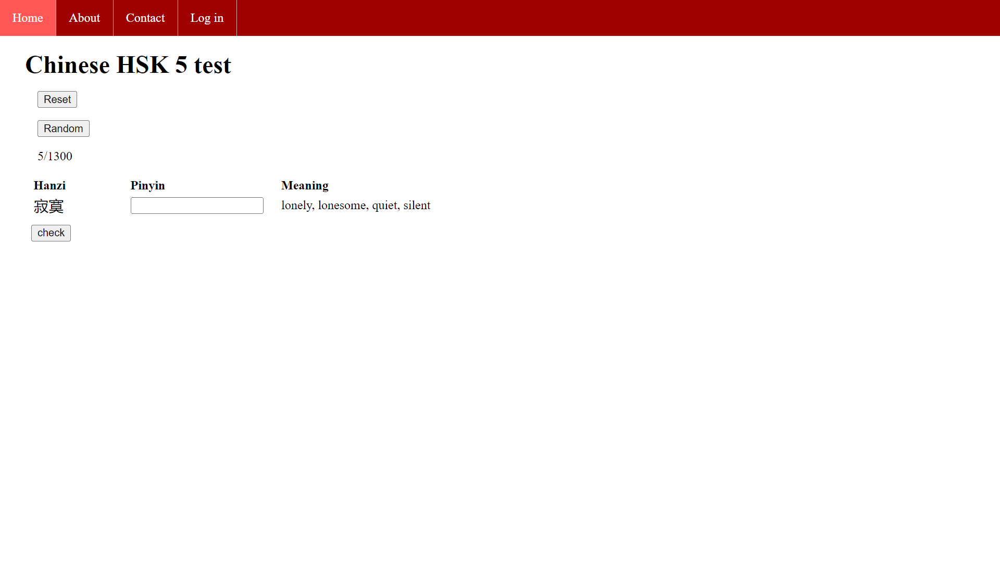

<a name="readme-top"></a>

# Learnchinese

This project is not completely functional yet, you can check the Roadmap list below to see the current state of the project. Once the main features are done, this app will be deployed on Heroku.

<details>
  <summary>Table of Contents</summary>
  <ol>
    <li><a href="#about-the-project">About The Project</a></li>
    <li><a href="#built-with">Built With</a></li>
    <li>
      <a href="#getting-started">Getting Started</a>
      <ul>
        <li><a href="#prerequisites">Prerequisites</a></li>
        <li><a href="#installation">Installation</a></li>
      </ul>
    </li>
    <li><a href="#usage">Usage</a></li>
    <li><a href="#roadmap">Roadmap</a></li>
    <li><a href="#contact">Contact</a></li>
    <li><a href="#acknowledgments">Acknowledgments</a></li>
  </ol>
</details>

## About The Project

This project was built with the purpose of learning Chinese and has a different methodology than the online tools or apps used commonly. This approach focuses on memorizing the Chinese vocabulary by learning his Chinese character (hanzi) and his pronunciation (pinyin).

This way you can improve your Chinese level in many aspects:
* Reading Chinese.
* Typing Chinese on computer/phone.
* Complementing your listening and speaking skills.

The idea is to progress on each hsk levels, from 1 to 6, and learn every single word of each level. Once you have learned some words you can test it in this app, just enter the pinyin without any tone mark and check your results.

I personally use this app to complement my Chinese study. Everyday I pick 10 words of my hsk level, I learn their hanzi, pinyin and meaning to test them on this app and then I go over all words I have learned so far.

<p align="right">(<a href="#readme-top">back to top</a>)</p>

## Built with
List of major languages, frameworks or libraries used in this project.
* Python
* Django
* MySQL
* HTML
* CSS
* Javascript

<p align="right">(<a href="#readme-top">back to top</a>)</p>

## Getting started

This project will be deployed on Heroku when the main features are finished. For now you can only get a local copy and install it following the next steps.

### Prerequisites

Install Python 3.9.13

### Installation

1. Activate environment
   ```sh
   source venv/Scripts/activate
   ```
2. Install requierements.txt
   ```sh
   pip install -r requirements.txt
   ```
3. Run local server
   ```sh
   python learnchinese/manage.py runserver
   ```
4. Go to the development server at http://127.0.0.1:8000/

<p align="right">(<a href="#readme-top">back to top</a>)</p>

## Usage

The usage is really simple. All you have to do is to select an HSK level and start testing!


This is the home or index page. There are 6 different levels and next to each level you have "X/Y SOLVED" which is the number of words solved and the number of total words. If you have completed the whole level then "COMPLETED" will be displayed.


This is an example of the HSK 5 level test. There are 2 buttons at the top: the first button 'Reset' resets the solved words turning all words of the current level to 'unsolved' state; the second button 'Random' picks a random word from the current level and displays it alone (image below).

Then you have 3 columns: Hanzi, Pinyin and Meaning. The first one represents the Chinese character, the second one is the input where you have to type his pinyin and the third one is the meaning of the word. After typing the pinyin press ENTER or Check button (at bottom of the page) to check your results.



This is an example of a random word picked to be tested. Same format as the main test.

<p align="right">(<a href="#readme-top">back to top</a>)</p>

## Roadmap

- [x] Add Word model and populate DB
- [x] Add Index page with all hsk levels
- [x] Add Test page with the test form
- [x] Add useful test buttons: Check, Random and Reset
- [x] Add horizontal navigation bar
- [x] Track number of solved words vs total
- [X] Add User feature
    - [X] Add User model that contains Word
    - [X] Add sign in, sign up and sign out
- [X] Fill About and Contact page
- [ ] Deploy app on Heroku
- [ ] Show/hide word's meaning in setting, as a hint
- [ ] Show/hide solved words in setting
- [ ] Add slide bar for Random words
- [ ] Design study plan for Users

<p align="right">(<a href="#readme-top">back to top</a>)</p>

## Contact

Zhouyu Guo - zhouyuzhouyu98@gmail.com

Project Link: [https://github.com/zhouyu9898/learnchinese](https://github.com/zhouyu9898/learnchinese)

## Acknowledgments

Credits to some really helpful resources.

* [Readme template](https://github.com/othneildrew/Best-README-Template)
* [Raw hsk json data](https://github.com/gigacool/hanyu-shuiping-kaoshi)

<p align="right">(<a href="#readme-top">back to top</a>)</p>


<!-- MARKDOWN LINKS & IMAGES -->
[index-screenshot]: images/index_page.png
[test-screenshot]: images/test_page.png
[random-screenshot]: images/random_page.png